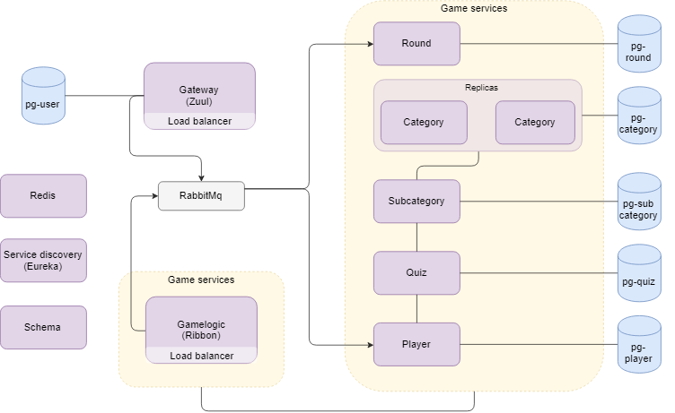

# Quiz game application 

[Repository](https://github.com/stellaselena/quizExam)  

## How to run 
1. `mvn clean install` (add -DskipTests to skip tests)  
2. `docker-compose build`  
3. `docker-compose up`  
4. To run integration tests: `mvn clean install -DskipIntegrationTests=false`   
5. [Postman collection](https://www.getpostman.com/collections/0c72dac72387d2959600) to manually test endpoints.   

## Implementation
  

- Gateway uses Zuul for load balancing and proxying. Stores user credentials and is used for authentication
- Redis to store distributed session 
- Eureka for service discovery
- RabbitMQ for message delivery
- Ribbon for load balancing
- Postgres for databases
- Wiremock for isolated tests
- Hystrix to handle service downtime